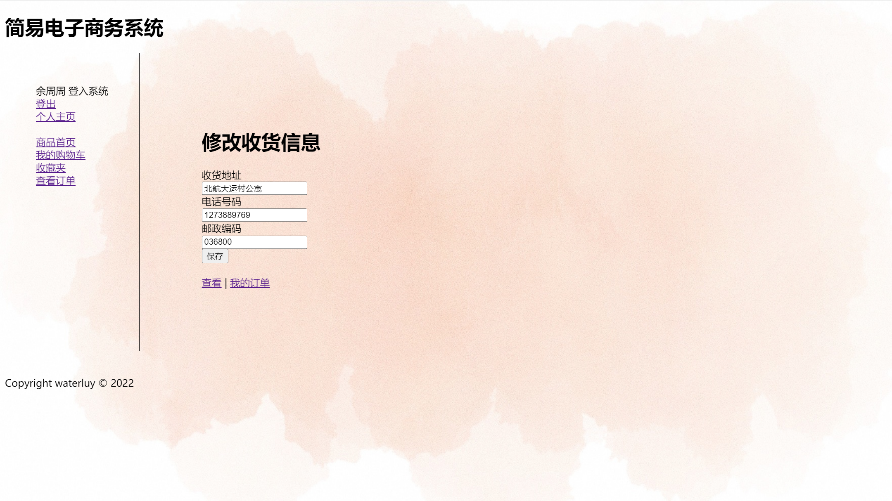
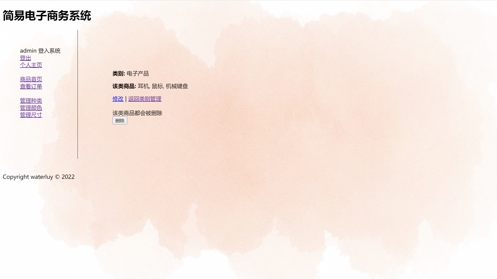
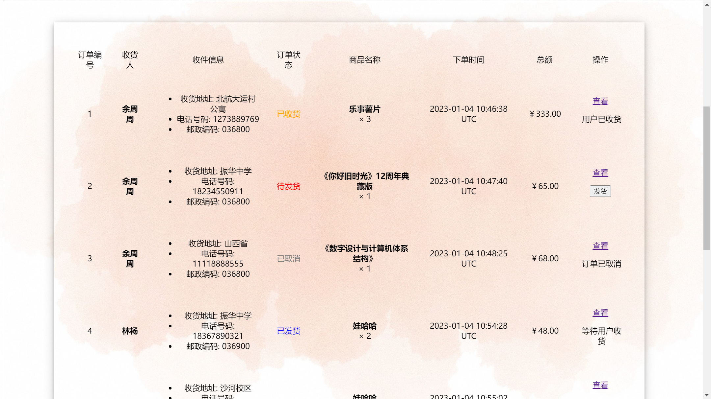

[toc]
# 简易电子商务系统

初始数据：

**管理员**

名称：admin
密码：123

**买家**

名称：余周周
密码：123

名称：林杨
密码：123

## 数据库设计
该项目为一个简易电子商务系统，管理员可以添加/修改商品、添加/修改商品属性、处理订单，顾客可以购买商品、加入购物车、收藏等操作。假设用户有无限多的余额。

本系统的数据库有 10 个实体：
+ 产品 product
+ 用户 user
+ 购物车 cart
+ 购物车项 cart_item
+ 收藏夹项 collect
+ 订单 order
+ 商品类别 category
+ 商品颜色 color
+ 商品尺寸 size
+ 商品评论 comment
  
使用脚手架生成上述模型，自动生成增删改查等操作以及 id、create_at 等属性

以及 10 个联系：
+ product belongs_to category, category has_many products
+ product belongs_to color, color has_many products
+ product belongs_to size, size has_many products
+ cart belongs_to user, user has_one cart
+ cart_item belongs_to cart, cart has_many cart_items
+ cart_item belongs_to product, product has_many cart_items
+ collect belongs_to user, user has_many collects
+ collect belongs_to product, product has_many collects
+ comment belongs_to product, product has_many comments
+ comment belongs_to user, user has_many comments

上述数据库设计整体可用PPT上的图来描述。

## 页面展示与功能

本系统支持三种身份的视图，管理员、买家与访客。为便于测试，在注册时允许以管理员身份注册。

### 登陆与注册

注册时进行密码一致性检验，注册时需选择身份为买家或管理员。


### 访客视图

访客只可浏览和查看商品，无法进行其他任何操作，商品首页可按商品类别查看。


### 买家视图

买家可以进行个人信息、购物车、收藏夹、订单等操作：


买家可以在商品首页添加商品到购物车或收藏夹, 但不能添加或修改商品。


用户可以查看商品详情，查看商品的评价或提问。用户只能删除自己发布的评论，而不能删除其他人的评论。


买家可以查看购物车, 可以查看商品，可以删除购物车内单项商品或者一键删除所有商品：


买家可以在购物车内生成订单：


买家可以查看收藏夹，在收藏夹内也可查看商品或添加至购物车，可以取消收藏：


买家可以查看自己的订单，订单有四种状态：待发货、已发货、已收货和已取消，订单不同的状态对应着允许进行的操作，比如只有在待发货时用户才能**取消订单**，在已发货时用户才能**确认收货**。用户确认收货后，商品的销量会增加。综上，用户对订单的操作有：生成订单、确认收货、取消订单。


买家可以查看订单、修改收货信息




买家可以查看和修改个人信息，包括修改密码。


### 管理员视图

管理员可以进行个人信息、商品添加/修改/删除，商品属性添加/修改删除，订单发货等处理。


管理员没有购物车和收藏夹，但可以编辑商品、删除或新建商品。


管理员可以管理商品的属性表，以 category 为例：




管理员可以查看所有订单，处理所有用户的订单发货，当订单为待发货时，管理员可以发货，用户确认收货或者取消订单后会显示相应的状态。管理员不能编辑订单，只能查看。




除此之外，管理员拥有和用户同样的查看功能。

## 重要功能的实现

### 密码

注册时要进行密码一致性检查，rails 可以自动完成该检查
```ruby
attr_accessor :password_confirmation
validates_confirmation_of :password
```
参考 《Web开发敏捷之道》，采用散列密码。创建散列密码，首先要创建一个唯一的 salt 值，其次将此 salt 值与明文密码相结合生成一个字符串，最后在结果上运行 SHA2digest，返回一个 40 个字符的十六进制数字。这样用户在注册表单上输入的并不是真实的密码，而是一个用来迷惑的 password，利用这个password 再映射成实际的密码，散列密码可以提高系统的安全性。

```ruby{.line-numbers}
class User < ApplicationRecord

    has_one :cart, :dependent => :destroy
    has_many :orders, :dependent => :destroy
    has_many :collects, :dependent => :destroy

    validates_presence_of :name
    validates_uniqueness_of :name

    attr_accessor :password_confirmation
    validates_confirmation_of :password

    validate :password_non_blank

    # 其他方法...

    # 密码相关
    def password
        @password
    end

    def password=(pwd)
        @password = pwd
        return if pwd.blank?
        create_new_salt
        self.hashed_password = User.encrypted_password(self.password, self.salt)
    end

    def self.authenticate(name, password)
        user = self.find_by_name(name)
        if user
            expected_password = encrypted_password(password, user.salt)
            if user.hashed_password != expected_password
                user = nil
            end
        end
        user
    end

    private
    def password_non_blank
        errors.add(:password, "Missing password") if hashed_password.blank?
    end

    def create_new_salt
        self.salt = self.object_id.to_s + rand.to_s
    end

    def self.encrypted_password(password, salt)
        string_to_hash = password + "wibble" + salt
        Digest::SHA1.hexdigest(string_to_hash)
    end
end
 
```

### 不同身份的访问控制

用户登陆后则将用户 id 保存在 session 中，在 ApplicationController 中定义 current_user，在各处均可访问。在购物车、订单相关的 views 中通过判断 current_user、current_user.admin? 来获取当前的用户信息，包括是否登陆和什么身份登陆，再根据登录信息做出对应的访问控制，只给用户展示允许访问的接口，而隐藏不可访问的接口。

同时要对用户不可访问的 action 添加 **before_action** 的检查，如果检查不通过则直接重定向到登陆界面。

```ruby{.line-numbers}
class ApplicationController < ActionController::Base

  helper_method :current_user

  # 其他方法...

  def current_user
    @current_user ||= User.find(session[:current_userid]) if session[:current_userid]
  end

  def must_login
        if !current_user
            redirect_to login_users_url, notice: "请先登录" unless (current_user)
        end
    end

    def must_admin
        if !(current_user && current_user.admin?)
            redirect_to login_users_url, notice: "管理员登录" unless (current_user && current_user.admin?)
        end
    end

    def must_buyer
        if !(current_user && !current_user.admin?)
            redirect_to login_users_url, notice: "买家登录" unless (current_user && current_user.admin?)
        end
    end
end

```

部分示例如下:

+ 产品的修改权限只有管理员有，其他属性管理同理

```ruby
# products_controller.rb
before_action :must_admin, except: [:index, :show]
```

+ 查看所有用户的权限只有管理员有
```ruby
# users_controller.rb
before_action :must_admin, only: %i[ index ]
```

+ 修改/更新个人信息的权限只有用户本人有
```ruby
# users_controller.rb
def show
    if !current_user
      redirect_to login_users_url, notice: '请先登录'
    elsif current_user.name != User.find(params[:id]).name
      redirect_to user_url(current_user), notice: '不能查看其他用户信息'
    end
end
```


### 购物车内一种商品只显示一项
如果用户将统一商品多次添加到购物车，购物车不会重复显示多次同样的商品，而是没种商品显示一项，包括添加的数量。

同样，用户对一项订单确认收获后，商品的销量会增加对应的数量。

```ruby{.line-numbers}
    def add_item(product_id)
        current_item = cart_items.find_by_product_id(product_id)
        if (current_item)
            current_item.quantity += 1
        else
            current_item = cart_items.build(:product_id => product_id)
            current_item.quantity = 1
        end
        current_item
    end
```

### 订单的四种状态及对应操作
订单有待发货、已发货、已收货、已取消四种状态，管理员只可以在订单为待发货状态时进行发货操作，买家可以生成订单、在待发货状态下取消订单、在已发货状态下确认收货。通过 current_user 的信息和 order.status 来判断当前情况允许进行哪些操作。一个例子如下：
```ruby
<% if current_user && current_user.admin? %>
  <% if order.status == "待发货" %>
    <p>
      <%= button_to "发货", change_status_orders_path(id: order.id) %>
    </p>
  <% elsif order.status == "已发货" %>
    <p>
      等待用户收货
    </p>
  <% elsif order.status == "已取消" %>
    <p>
      订单已取消
    </p>
  <% else %>
    <p>
      用户已收货
    </p>
  <%end%>
<%end%>
<% if current_user && !current_user.admin? %>
  <% if order.status == "待发货" %>
    <p>
      耐心等待发货
    </p>
  <% elsif order.status == "已发货" %>
    <p>
      <%= button_to "确认收货", order, method: :delete %>
    </p>
  <% elsif order.status == "已取消" %>
    <p>
      订单已取消
    </p>
  <%else%>
    <p>
      订单已完成
    </p>
  <%end%>
<%end%>
```
